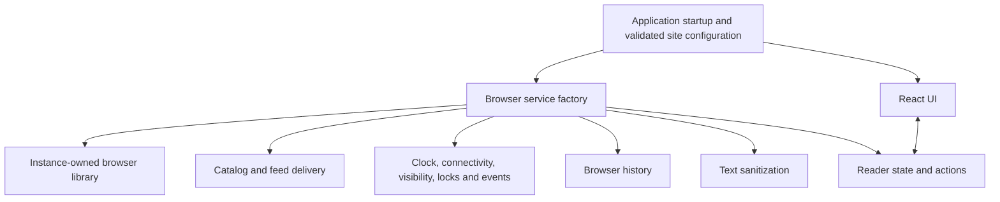

# Reader application boundaries

The reader keeps its library in the browser and accepts a configured collection
without requiring a new UI implementation. This document describes the service
boundary introduced after the React migration. The product roadmap and original
audit remain in [reader-refactor.md](reader-refactor.md); deployment inputs are
documented in [reader-configuration.md](reader-configuration.md).

The next increment defines [reader items and source adapters](reader-item-contract.md).
It moves format interpretation, identity, item bounds, and duplicate merging
behind shared contracts used by delivery, the store, and backup restoration.

## Composition and ownership

[`main.jsx`](../web/src/main.jsx) selects the validated site configuration and
creates one service set and one store. It mounts React and starts application IO
once. Its hot-reload cleanup destroys the store and unmounts React.

[`reader-services.mjs`](../web/src/reader-services.mjs) composes these concrete
browser implementations using the same site configuration supplied to the UI.
[`reader-store.mjs`](../web/src/reader-store.mjs) accepts the resulting object as
its second argument. The store does not choose a database, fetch an endpoint,
read browser globals, or register a timer directly. Constructing the store
creates state; `start()` initiates IO and event subscriptions.

This is a small function boundary, with no dependency-injection container or
runtime plugin registry. Tests can supply services directly without replacing
`window`, `document`, or `navigator` for the whole process.

| Service | Contract |
| --- | --- |
| `library.openLibrary(onWarning)` | Resolve arrays named `articles`, `state`, `feeds`, and `settings`. Report persistent-storage failure to this reader's warning callback and preserve operation in memory. |
| `library.save(table, items)` | Resolve when the write has settled in persistent storage or the in-memory fallback. Preserve invocation order with reads and removals from the same library. |
| `library.removeArticles(ids)` | Remove those item bodies without discarding their read/saved marks. Resolve after persistent storage or fallback has settled. |
| `loadCatalog({signal})` | Return catalog data that the store normalizes before use. The browser implementation resolves the configured base path, checks HTTP responses, and verifies matching OPML when configured. |
| `loadFeed(feed, {signal})` | Resolve `{items, transport, fetchedAt, stale}` using the existing normalized item and provenance contract. The browser service binds the configured proxy; the store does not construct service URLs. |
| `cleanText(value)` | Return safe plain text for item titles, excerpts, backups, and exports. The browser composition supplies the existing DOMPurify implementation. |
| `createNavigation(options)` | Supply `start`, `go`, `switchMode`, `close`, `endSearch`, and `destroy` using the existing route-normalization and apply callbacks. |
| `runtime.now()` | Return milliseconds since the epoch for refresh deadlines, retention, displayed time, and export timestamps. |
| `runtime.isOnline()` / `runtime.isVisible()` | Read the current environment at the time of the decision. |
| `runtime.withLock(name, signal, work)` | Run asynchronous work under the named browser lock when available. Preserve cancellation; run directly when locks are unavailable. |
| `runtime.subscribe(callbacks)` | Subscribe `online`, `offline`, `visibility`, and one-minute `tick` callbacks; return a function that removes this subscription's listeners and timer. |

Custom services must preserve these semantics, including sanitization, ordered
persistence, and cancellation. Network and storage failures are separate: a
publisher failure must not imply that the browser cannot save an item.

Feed results contain structurally validated source items. The store's shared
`mergeSourceItem` boundary prepares their plain-text fields and attribution
before storing them as reader items; the store contains no format-specific
parsing or duplicate policy. Publisher HTML remains untrusted until display.

## Library isolation and compatibility

[`storage.mjs`](../web/src/storage.mjs) exports `createBrowserLibrary(site)`.
Each call owns its database connection, fallback maps, operation queue, and
warning recipient. Importing the module does not instantiate a library or import
the default Sound & State configuration. Different storage namespaces therefore
select independent libraries, even when used within the same application process.

The existing database name for Sound & State, Dexie schema versions 1 and 2,
table names, stored records, and reading-backup version remain unchanged. Two
instances deliberately using the same namespace still address the same
persistent database. Namespaces prevent accidental mixing; they do not create a
security boundary between applications on the same origin.

Persistent reads, saves, and removals run in invocation order. The memory copy
updates before a write is attempted, so a write failure retains the accepted
intent for this visit. Successful reads replace each fallback snapshot, including
deletions made by another tab. An older pending read cannot later overwrite a
newer save in that fallback. A storage failure affects only its library instance,
and the warning mentions backups only when that collection enables them.

This queue orders one instance's operations; it is not a cross-tab transaction
or a new synchronization protocol. Refresh retains the existing namespaced Web
Lock and rereads persistent freshness after acquiring it. Broader cross-tab
conflict handling and multi-table atomic backup imports remain separate work.

## Lifecycle and cancellation

The store owns startup and feed-refresh abort controllers. Destroying it aborts
catalog/feed requests, removes its browser subscriptions and navigation
listeners, and clears active loading state. A late catalog response cannot
replace a newer startup. A canceled feed request cannot publish new items or
failure status, and cancellation during a content write cannot subsequently
mark that feed fresh.

Already accepted library writes finish. Cancellation does not promise to undo
a save or interrupt a database write already underway. Restart waits for queued
read/save intents before restoring the library. Pruning checks that its owning
startup or refresh is still current before beginning and before changing the
visible library. A previous refresh's completion cannot consume work queued by
a later lifecycle.

The browser catalog and feed clients retain omitted credentials and referrers,
request timeouts, validation, and the existing service allowlist. Site
configuration and schema compatibility are still deployment concerns; an
additional browser adapter does not expand the Cloudflare service's accepted
formats or destinations.

## Verification

- [Store tests](../tests/reader-store.test.mjs) exercise overlapping saves and
  reads, refresh cancellation, catalog restart, independent environments, clock
  decisions, and subscription cleanup.
- [Storage tests](../tests/storage.test.mjs) exercise namespace and warning
  isolation, ordered fallback writes, and snapshots after cross-tab deletion.
- [Runtime tests](../tests/browser-runtime.test.mjs) exercise browser listener and
  timer ownership, lock forwarding, and cancellation without locks.
- [Network tests](../tests/network.test.mjs) exercise catalog base paths, optional
  OPML, validation, cancellation, and request privacy.
- The [shared runtime fixture](../tests/fixtures/reader-runtime.mjs) controls time
  and events independently for each store. The existing browser suite exercises
  actual IndexedDB, storage denial, navigation, all five browser profiles, and
  the alternate-brand build through the production composition.

Run `npm test`, `npm run build:web`, and `npm run test:browser` from the repository
root with Node 24 or newer. This change does not introduce a database migration,
package dependency, UI redesign, or new feed-service capability.
