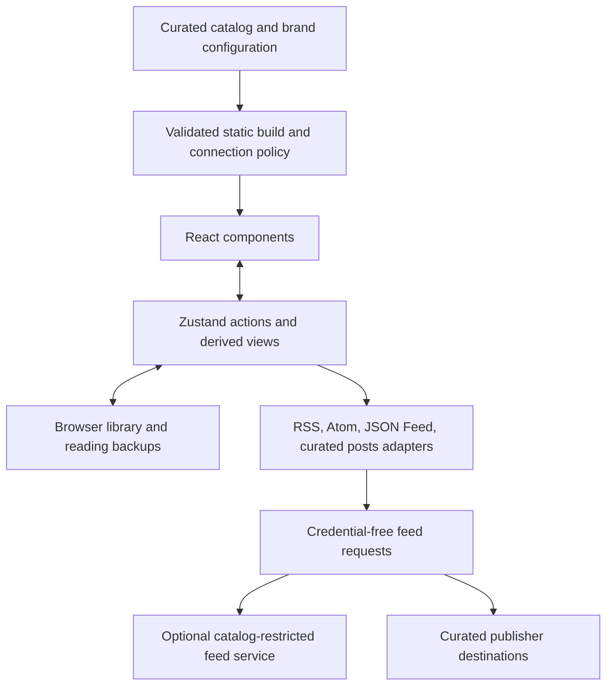

# A portable reader for curated communities

Review date: 2026-09-17. This document records the live-reader audit, the boundaries
for the React migration, and the architecture and product work that remain after that migration.
It is an engineering and product plan, not a claim of accessibility conformance
or a production deployment record.

The current priority is architecture before further end-user UX iteration.
Phase 1 is deployed. Phase 2 now strengthens the application service boundaries,
then the item/source contracts and persistence guarantees. Discovery work is
deferred until those increments are complete and verified.

## Product direction

Help anonymous visitors follow a place or topic, recognize the people and
organizations reporting on it, and discover useful information they would
otherwise miss. A collection is an editorial promise about coverage and sources.
It should be useful before someone changes preferences or builds a reading habit.

Keep chronological reading available and explain every alternative ordering.
Do not rank popularity by default, equate volume with importance, or require
accounts or behavioral tracking to make a collection useful. Anonymous local
preferences, Saved, and exportable backups support a reader's choices without
becoming prerequisites for discovery.

Success means a visitor can answer these questions quickly:

- What place or topic does this collection cover, and who curates it?
- What is new, which source published it, and what kind of source is that?
- How can I find a neighborhood, topic, publication, or account?
- Can I open the original, save this item, and recover my choices later?
- Are results limited by my filters, unavailable sources, or what has loaded?

## Audit evidence and limits

The live site was exercised at desktop 1280 by 720 and phone 390 by 844, including
Articles, Posts, topical filters, an article preview, Tab, Escape, and focus
restoration. The audit also read the reader skill, application modules, shared
fixtures, and existing browser tests. Ordinary browsing caused the site's normal
feed requests; no separate publisher-health sweep was run.

The browser inherited a returning visitor's library. Counts below describe that
session, not a clean first visit or a benchmark. No personal library screenshots
are committed. Screen-reader behavior with NVDA or VoiceOver remains unverified;
an accessibility tree and automated audit cannot substitute for those checks.

| Finding | Evidence | Consequence and response |
| --- | --- | --- |
| Status competes with reading | Existing articles were visible at 69 of 92 feeds checked, but the status said “Wait to start reading.” Loading, unavailable feeds, a catalog notice, and new-item insertion occupied separate areas. | Let visitors read available content during refresh. Consolidate progress, freshness, and recoverable errors without concealing unavailable sources. |
| The phone puts substantial UI before content | In the observed returning session, the first headline began roughly 540 pixels below the top. | Prioritize the reading task. Keep detailed feed status behind an accessible disclosure and measure the first useful content position in normal and degraded states. |
| Discovery is less visible than backlog management | Sections live inside Filters; the default Unread view showed about 1,449 items. | Make curated collection entry points visible. Keep unread tracking useful without framing the whole collection as unfinished work. |
| Volume dominates chronological lists | Visible results included clusters from prolific publications and several reports about the same event. | Explore an explicit discovery view that limits consecutive items from one source and identifies repeated coverage. Preserve Latest and explain ordering; do not hide viewpoints through opaque ranking. |
| Source categories are not story topics | The filter correctly warns that a publication's individual stories may cover other topics. Posts expose account selection but no corresponding topic sections. | Model collection membership, source coverage, editorial form, platform, and item topics independently as the product grows. |
| Search scope is easy to miss | The explanation that search covers loaded items in the current view is visually hidden. | Show concise search scope and useful empty-result recovery when filters or loaded coverage constrain results. |
| Scroll marking can surprise casual visitors | Existing tests explicitly preserve marking read on scroll and Unread as defaults. | Preserve current behavior during the technical migration. Evaluate an explicit preference choice separately before changing how returning users' lists behave. |
| Light-theme hover contrast missed existing assertions | The pre-refactor build failed the new axe smoke on the hovered Unread control: `#208368` on `#f9f9f8` measured 4.42:1 at 15 pixels, below 4.5:1. The dark-phone smoke passed its six states. | Verify semantic colors in interactive states as well as resting article text. Retain the failing case as a regression check when adjusting the palette. |
| Visual and interaction foundations are strong | Readable editorial typography, restrained surfaces, clear Articles/Posts separation, shared Saved, labelled dialogs, visible focus, and approximately 44-pixel controls. No overflow observed at phone width. | Preserve these strengths. A framework migration is not a reason to replace the visual identity or reduce accessibility coverage. |

Opening the article preview focused its title; Tab reached the title link; Escape
restored focus to the relevant control or the next item when the opened item left
Unread. Filter selection closed the modal and restored focus to Filters. The
native dialog's backward-Tab behavior needs assistive-technology review: the DOM
reported the document body after Shift+Tab from the first Close control. That
observation alone does not establish a focus-trap defect.

## Architecture assessment

The existing separation between the static catalog, browser library, and
Cloudflare feed service is appropriate for an anonymous public reader. The
browser owns read history, preferences, and saved content. The service owns
bounded delivery of approved feeds and shared snapshots. Keep those boundaries;
React does not require server rendering, accounts, or a new application backend.

The main refactoring pressure is the client orchestration. The previous
`web/src/main.mjs` combined startup, mutable state, DOM construction, event
binding, routing, dialogs, loading, persistence, and backup controls. UI changes
therefore crossed many responsibilities. The stylesheet also accumulated
successive overrides of the same components, making the final presentation hard
to reason about. Extracting components while retaining a second imperative DOM
renderer would preserve that ownership problem.

Several domain modules are worth retaining: content sanitization, dates,
normalization, navigation compatibility, scrolling/read behavior, storage, and
export logic already have useful tests. The existing five-project browser matrix
uses fictional publisher responses, isolates browser storage, and rejects
unexpected external requests. Reuse it as the migration contract.

The original source model inferred Posts from the `bluesky` category and related
identifiers. That is a useful compatibility rule but an unsuitable extension
point for arbitrary social platforms. Seattle-specific editorial fields also
should not be required by every instance of the reader. Introduce a small public
reader catalog with explicit content kind and format, while keeping Seattle's
editorial schema and publication workflow intact.

## Migration boundaries

Phase 1 describes the completed React migration. The architecture follow-up is
Phase 2; its current service boundaries are documented in
[reader-architecture.md](reader-architecture.md). The discovery redesign,
taxonomy expansion, measured performance work, and manual screen-reader review
remain follow-up work. Passing a React build alone does not complete those goals.

| Boundary | Responsibility | Guardrail |
| --- | --- | --- |
| React application and components | Render the shell, lists, source directory, dialogs, and reusable item actions from state. | One owner for each DOM subtree; stable item keys; no parallel legacy renderer. |
| Zustand reader store | Coordinate the active route, library, feed status, user actions, and asynchronous changes. | Keep derived lists/counts derived; make updates explicit; avoid duplicate copies of the same state in component effects. |
| Pure reader domain | Normalize routes and classify/filter items independently of React. | Preserve legacy links and saved items whose source left the catalog. |
| Source adapters | Convert RSS, Atom, JSON Feed, and the documented posts JSON shape into one item contract. | Validate at the boundary; retain content provenance; sanitize all publisher HTML and safe-link targets. |
| Persistence and backups | Store browser-owned data and export/import it through a validated contract. | Preserve existing Sound & State data; isolate other brands by namespace; remain usable when storage fails. |
| Site configuration | Supply brand text, local assets, catalog selection, capabilities, and theme preset. | Configuration is trusted deployment input, not an arbitrary endpoint supplied by a visitor. |
| Feed service | Fetch the deployed catalog's allowed feeds and verified exact redirects. | New frontend formats do not expand the service's allowlist or change its XML assumptions automatically. |

The implementation uses these concrete entry points:

| Module | Delivered responsibility |
| --- | --- |
| `web/src/main.jsx` | Compose browser services, create the reader store once, and mount React. |
| `web/src/reader-services.mjs` | Bind storage, delivery, runtime, sanitization, and navigation to the selected site configuration. |
| `web/src/browser-runtime.mjs` | Own browser connectivity, visibility, clock, lock, and subscription access. |
| `web/src/storage.mjs` | Create instance-owned browser libraries with ordered persistence and independent memory fallback. |
| `web/src/app.jsx` | Compose the header, reading controls, status, and active list. |
| `web/src/components/items.jsx` | Reuse item metadata, attribution, actions, and sanitized preview content. |
| `web/src/components/dialogs.jsx` | Own native dialog lifecycle and source/section filters. |
| `web/src/components/reader-help.jsx` | Render reader help through the configured identity and capabilities. |
| `web/src/reader-store.mjs` | Coordinate lifecycle and user actions with storage, network, and navigation modules. |
| `web/src/backup.mjs` | Validate backups and merge imported data consistently in memory and persistent storage. |
| `web/src/catalog.mjs` and `web/src/site-config.mjs` | Validate portable source data and deployment configuration. |
| `config/vite.config.mjs` | Select explicit site configuration through `READER_SITE_CONFIG`, emit public assets and connection policy, and avoid loading private `.env` files. |

The migration also fixes an existing backup consistency problem: an imported
duplicate could retain one version in memory while a bulk persistent write
overwrote it with another. A single merge decision must determine the visible
library and the data that survives reload. This is a behavioral regression case,
not merely a file-organization improvement.

Two focused UX improvements are included: active content searches now show
“Searching items already loaded in this view,” and the light jade accent is
darkened to `#187357` to correct the measured hover contrast failure. The existing
editorial typography, native dialogs, and automatic/light/dark appearances remain.
Jade and blue use free Radix-based semantic palettes. The progress/status layout
and its “Wait to start reading” behavior are preserved in this migration; their
redesign remains Phase 3 work rather than an implied completed improvement.

Apply SOLID where it clarifies those boundaries: components have a presentation
responsibility, adapters share a normalized output contract, and orchestration
uses storage/network/domain modules rather than reimplementing them. Prefer
functions and small modules over inheritance, general plugin systems, or a large
dependency-injection framework. Shared item actions, dates, attribution, source
details, and dialog behavior are valuable reuse; article and post presentation
can remain different where reading behavior differs.

Use effects to synchronize with browser systems such as history, media queries,
scroll observation, and native dialogs. Keep event-specific work in actions and
derive filtered content from current state instead of copying it into another
effect-managed field. This follows React's guidance on
[when an Effect is unnecessary](https://react.dev/learn/you-might-not-need-an-effect).

### Portable data and branding

A deployment should be reproducible from a site configuration and a validated
catalog. A new instance must not require editing components, hard-coding a new
platform name in presentation code, or changing Sound & State's editorial data.
Keep a fictional second-brand example to demonstrate that property.
The supported configuration fields, JSON envelopes, and build invocation are in
[Configure another reader](reader-configuration.md).

The public source contract needs stable IDs, names, source websites, allowed feed
URLs, category membership, explicit `articles` or `posts` kind, and an explicit
format or safe automatic detection. Normalized items need a stable identity,
source IDs, kind, original URL, title/text, sanitized content, author, and separate
publication/update timestamps when supplied. Never invent timestamps for missing
publisher values. Preserve source identity when duplicate items merge.

[JSON Feed 1.1](https://www.jsonfeed.org/version/1.1/) is the interoperable JSON
choice. A custom posts JSON format should have a documented envelope, validation,
and fixtures; it must not mean accepting arbitrary third-party JSON through
heuristics. Platform-specific account APIs belong behind adapters only when a
concrete collection needs them.

Brand configuration should cover metadata, name, tagline, purpose, hosting text,
logo/sharing assets, storage namespace, enabled capabilities, and palette. Retain
the current free, locally served typefaces and MIT-licensed Radix color foundations. Offer
a small set of semantic token presets rather than importing an unrelated paid
theme or a dashboard framework. Light, dark, and automatic appearance must work
across lists and dialogs. Brand colors need contrast checks; a licensed palette
does not guarantee that every combination is accessible.

New origins must remain explicit in the generated connection policy. Private
environment files must never enter the frontend build. A second deployment needs
its own service/catalog compatibility decision: supporting JSON in the browser
does not make the current Cloudflare XML feed service a generic JSON proxy.
Namespaces avoid accidental library mixing; use separate origins for unrelated
operators because a namespace is not a security boundary between applications
on the same origin. Help text must reflect each instance's actual delivery path,
host, caching guarantees, and enabled features.

## Phased delivery and acceptance

### Phase 1: portable implementation and compatibility

Deliver the React renderer, Zustand orchestration, validated reader/site
contracts, adapters, reusable controls, and regression coverage. Preserve current
routes, saved data, browser-only preferences, direct retry privacy settings,
content sanitization, and existing deployment defaults. Keep root generated
README/OPML ownership unchanged.

Acceptance requires:

- Existing deterministic unit tests and all five browser projects pass against
  the production build, including legacy routes and storage failure.
- A fictional alternate catalog and brand can build from configuration, with
  explicit Articles/Posts kinds independent of category names.
- RSS/Atom compatibility, JSON input validation, stable item identity,
  sanitization, timestamp handling, and duplicate behavior are tested.
- The default namespace opens the existing Sound & State library. Separate
  namespaces do not overwrite one another's preferences or saved items.
- New source formats do not bypass connection restrictions, introduce publisher
  images/trackers, or disclose cookies, credentials, or referrers.
- Every visible action is implemented; no legacy UI is hidden behind a new shell
  while silently owning the same controls.

| Acceptance area | Evidence required |
| --- | --- |
| Existing reading contracts | All unit and five-project browser checks; Articles/Posts, shared Saved, old links, back/forward, pagination, exclusions, and source removal. |
| Portable sources | Fictional RSS, Atom, JSON Feed, and posts JSON inputs; invalid envelopes/URLs, duplicate IDs, missing dates, safe HTML, and explicit content kinds. |
| Brand isolation | Alternate configuration build; correct metadata/assets/capabilities; distinct storage namespace; default namespace compatibility. |
| Data durability | Read/save preferences after reload, unavailable storage, malformed backup rejection, and imported duplicates consistent before/after reload. |
| Accessible presentation | Axe smoke in both themes, existing keyboard/layout checks, rendered phone/desktop review, and separately recorded manual screen-reader results. |
| Privacy and delivery | Mocked requests verify omitted credentials/referrers and approved endpoints; no unrequested publisher asset loads; Worker policy remains separately enforced. |
| Operational readiness | Production build, license notices, local documentation references, relevant guidance checks, and clean whitespace validation. |

### Phase 2: strengthen architecture before further UX iteration

Deliver focused increments with the current reading experience as the regression
contract. The first increment introduces explicit service composition,
instance-owned libraries, injectable browser lifecycle and time, cancelable
catalog delivery, and deterministic isolation/cancellation tests. See the
[service contracts and ownership decisions](reader-architecture.md).

Continue in this order:

1. **Application boundaries and lifecycle:** complete the service-boundary
   increment and verify it in the existing five-browser matrix and alternate
   collection build. Keep browser globals and default-brand selection out of
   the state coordinator. Preserve accepted saves when background work stops.
2. **Normalized item and source contracts:** separate format parsing, item
   identity/provenance, merge policy, and refresh scheduling where these still
   share modules. Make adapter and backup compatibility explicit through common
   contract tests, including duplicate coverage across kinds, malformed inputs,
   missing dates, source removal, and content safety. Add platform adapters only
   for concrete source formats.
3. **Persistence and schema evolution:** define collection compatibility for
   imports, versioned migration policy, and failure behavior for multi-table
   operations. Exercise interrupted imports and cross-tab conflicts using
   fictional libraries before changing stored records or backup versions.
4. **Build and delivery guarantees:** keep default and alternate configurations
   reproducible, verify generated connection policies and service-format
   compatibility, and establish measured bundle/runtime baselines. Introduce
   performance changes only where measurements identify a useful improvement.

Each increment requires behavior-focused tests, a production build, appropriate
browser coverage, and updated architecture documentation. Preserve existing
libraries and deep links throughout. These changes do not require new accounts,
administration UI, an extensible plugin framework, or a new application backend.

### Phase 3: make curated discovery visible

Design and test a visible collection overview and clear locale/topic paths.
Explain the curator, source scope, and ordering. Combine freshness/progress/error
status without pushing content below a wall of notices. Show what search covers.
Evaluate the initial Latest/Unread choice with people who visit occasionally.

Keep chronology as the baseline. Prototype an explicitly labelled discovery
view, if useful, with predictable source diversity and transparent grouping of
related coverage. Use curated metadata and local choices; do not add popularity
or engagement ranking by default. Keep community-serving publishers alongside
comparable reporting sources and follow the
[publisher-description process](publisher-description-review.md).

Acceptance requires phone and desktop walkthroughs in fresh, returning,
partially loaded, unavailable-feed, empty, and heavily filtered states. A visitor
must be able to identify the collection and find a relevant source without
knowing the term “feed.” Clear filters and return to chronological reading must
remain easy to find.

### Phase 4: prove accessibility and operational quality

The existing suite covers focus, responsive overflow, long text, forced colors,
theme contrast, dialogs, and storage limits. The new
[accessibility smoke](../tests/browser/accessibility.spec.mjs) checks major views
and dialogs with axe on light desktop and dark phone Chromium using only
[shared fictional fixtures](../tests/fixtures/README.md). It keeps incomplete
checks as artifacts for human review and does not disable inconvenient rules.
Other browser engines retain the full behavior suite.

After the contrast fix, the focused smoke passed both configured runs: six views
each in light desktop and dark phone Chromium, with both About disclosures
expanded. Its fixture-only screenshots were visually reviewed for Articles,
preview, filters, and expanded About in both layouts: text reflowed and the modal
controls remained visible without horizontal clipping. These observations do
not establish behavior on a physical phone or replace the manual checks below.

Use [WCAG 2.2](https://www.w3.org/WAI/WCAG22/Understanding/) as the accessibility
target. Automated checks cover only detectable failures. Before describing the
reader as conformant, manually exercise NVDA with Firefox or Chromium and
VoiceOver with Safari: landmarks, heading navigation, reading-mode state,
announcements, modal entry/exit, backward/forward Tab, removed-item focus,
error recovery, and loading without disruptive repetition. Include 200% zoom,
400% reflow, reduced motion, forced colors, and touch with long source names.

The production build comparison below used Node 24.19.0 and Vite 8.3.0. The
baseline is an isolated snapshot of `96c3dfa`; both builds used the same installed
dependencies, whose pre-existing runtime versions were unchanged. Gzip totals
compress each emitted file separately with Node's default level 6. They exclude
HTML, fonts, images, catalogs, OPML, and notices.

| Shipped code | Baseline raw bytes | Refactor raw bytes | Baseline gzip bytes | Refactor gzip bytes |
| --- | ---: | ---: | ---: | ---: |
| JavaScript | 346,157 | 601,591 | 118,738 | 197,306 |
| CSS | 37,011 | 37,352 | 7,850 | 7,965 |
| Combined | 383,168 | 638,943 | 126,588 | 205,271 |

The migration adds about 77 KiB of compressed code, a 62% increase in these
assets. React and Zustand live in a separate runtime chunk so browsers can reuse
it across application edits; this does not reduce a first visit's download.
Story cards skip renders for unrelated feed-progress changes, and the viewport
avoids unnecessary layout reads. Neither improvement establishes a faster
reader without device measurements.

Measure initial useful content time, parsing time, route/search interaction,
rendering under large catalogs, and memory after repeated refreshes.
Use fictional data and report the device/profile; the live audit counts are not
a performance baseline. Profile before introducing virtualization, workers, or
additional cache libraries. Pagination may be preferable to virtualization
because headings, browser search, focus, and scroll marking remain simpler.

### Phase 5: adopt a second real collection

Choose one concrete additional locale or topic and validate the configuration
boundary with its curator. Document which formats and hosting/service choices it
needs. Review editorial descriptions, availability, privacy explanations,
branding assets, and backup behavior. Extend the versioned schema with migration policies and broader
taxonomy only when that collection demonstrates the need.

Multi-tenant administration, hosted account sync, generalized social scraping,
paid themes, analytics, and popularity ranking are not delivered by this
migration. They require separate product decisions and must not become implicit
dependencies of anonymous reading.

## Verification and release discipline

Use Node 24 or newer and run commands from the repository root. For this client
migration, run `npm test`, `npm run build:web`, and `npm run test:browser`. A focused
accessibility rerun uses `npm run test:browser -- accessibility.spec.mjs` after
the build. Catalog/generator changes additionally require `npm run ci`; service
changes require `npm run check:proxy`. Skill/instruction edits use
`npm run check:agents` and the
[guidance validation procedure](agent-guidance-validation.md).

Record actual check outcomes in the change report. This document defines the
acceptance work; it does not imply that an unrun check passed. Inspect rendered
phone/desktop output and run `git diff --check` before finishing. Deployment and
snapshot refresh are separate external writes and require task authorization.

Verification completed for this migration:

- All 68 unit tests and the production build passed. Catalog generation,
  validation, README lint, and OPML checks passed; the published catalog and root
  generated files have no changes.
- The final browser run passed 317 checks across desktop Chromium, Firefox, and
  WebKit plus phone Chromium and WebKit, using two workers. The three intentional
  skips are redundant axe runs outside its two configured profiles. Those two
  profiles passed all twelve audited view/theme combinations.
- A separate branded build passed in all five profiles, including both JSON
  adapters, saved items after reload, isolated storage, and capability-aware help.
- Guidance validation passed for 11 files, 113 local links/anchors, and three
  aligned canonical/Claude skill pairs. The new documentation's local links and
  commands were checked. The Worker dry run and whitespace check passed.
- NVDA/VoiceOver, physical-device testing, and runtime performance benchmarks
  remain unperformed. No deployment, snapshot refresh, or separate live
  publisher-health sweep was run.

Keep the existing reader skill as the canonical operational entry point and its
Claude adapter aligned. Update its source map after module moves rather than
copying implementation recipes into several instruction files. Keep the
catalog, reader, and feed-service skill boundaries: an adapter-format change may
affect both reader and service, while a palette change does not require a live
publisher audit.
